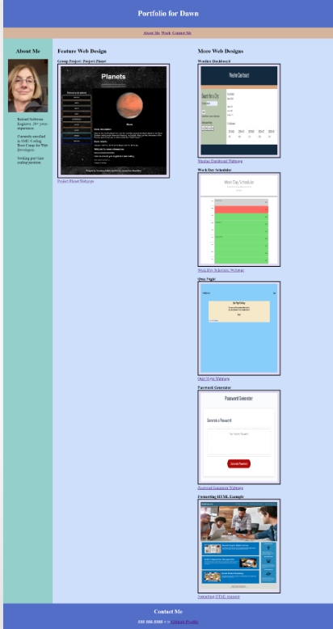

# Portfolio
This is the second Challenge, creating a portfolio page.  This page can be added to as the course progresses.

# Description

This challenge is about making a portfolio with these features:
   A portfolio page is displayed with a photo/avatar of the developer and links to sections: about the developer, work examples, and contact information

# User Story: 
An employer would like to view a potential employee's deployed portfolio of work samples to assess whether they're a good candidate for an open position.

# Acceptance Criteria: 

When an employer loads  the portfolio they are presented with the developer's name, a recent photo or avatar, and links to sections about them, their work, and how to contact them.

When the employer clicks one of the links in the navigation the UI scrolls to the corresponding section.

When the employer clicks on the link to the section about their work
 the UI scrolls to a section with titled images of the developer's applications.

When the employer is presented with the developer's first application
that application's image should be larger in size than the others.

When the employer clicks on the images of the applications they are taken to that deployed application.

When the employer resize the page or view the site on various screens and devices, they are presented with a responsive layout that adapts to my viewport.

## Mock-Up

The following animation shows the web application's appearance and functionality:

## Screenshot:

## Challenge Links:

The URL of the deployed application: https://dawn-kline-m.github.io/Portfolio/

The URL of the GitHub repository that contains my code:  https://github.com/dawn-kline-m/Portfolio.git

## Code source:

I used coding examples from prior lessons and I did receive guidance and suggestions from my TA and my tutor.